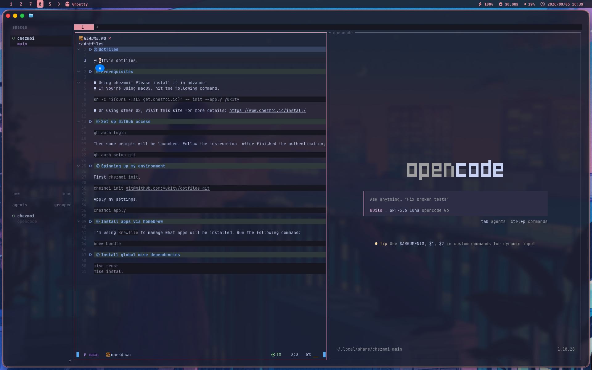

# dotfiles

helloyuki's (GitHub ID: yuk1ty) dotfiles.



## Prerequisites

- Using chezmoi. Please install it in advance.
- If you're using macOS, hit the following command.

```
sh -c "$(curl -fsLS get.chezmoi.io)" -- init --apply yuk1ty
```

- Or using other OS, visit this site for more details: https://www.chezmoi.io/install/

## Set up GitHub access

```
gh auth login
```

Then some prompts will be launched. Follow the instruction. After finished the authentication, then:

```
gh auth setup-git
```

## Spinning up my environment

First `chezmoi init`.

```
chezmoi init git@github.com:yuk1ty/dotfiles.git
```

Apply my settings.

```
chezmoi apply
```

## Install apps via homebrew

I'm using `Brewfile` to manage what apps will be installed. Run the following command:

```
brew bundle
```

## Install global mise dependencies

```
mise trust
mise install
```
